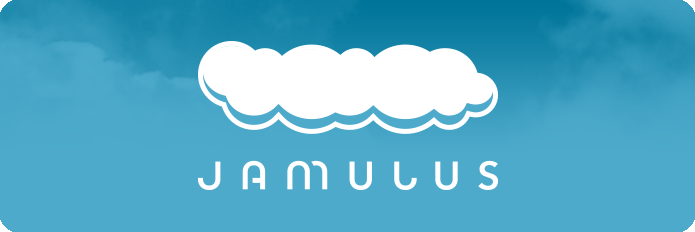

Jamulus - Internet Jam Session Software
=======================================

The Jamulus software enables musicians to perform real-time jam sessions over the internet.
There is one server running the Jamulus server software which collects the audio data from
each Jamulus client, mixes the audio data and sends the mix back to each client.

Jamulus is __Open Source software__ ([GPL, GNU General Public License](http://www.gnu.org/licenses/gpl-2.0.html))
and runs under __Windows__ ([ASIO](http://www.steinberg.net)),
__MacOS__ ([Core Audio](http://developer.apple.com/technologies/mac/audio-and-video.html)) and
__Linux__ ([Jack](http://jackaudio.org)).
It is based on the [Qt framework](https://www.qt.io) and uses the [OPUS](http://www.opus-codec.org) audio codec.

The source code is hosted at [Sourceforge.net](http://sourceforge.net/projects/llcon).

Required Hardware Setup
-----------------------

The required minimum internet connection speed is 200 kbps for the up- and downstream.
The ping time (i.e. round trip delay) from your computer to the server should not exceed 40 ms average.

For the Jamulus software to run stable it is recommended to use a PC with at least 1.5 GHz CPU frequency.

On a Windows operating system it is recommended to use a sound card with a native ASIO driver.
This ensures to get the lowest possible latencies.

Windows Download and Installation
---------------------------------

[Download](http://sourceforge.net/projects/llcon/files) a Windows installer at the
Sourceforge.net download page

The Jamulus software requires an ASIO sound card driver to be
available in the system. If your sound card does not have native
ASIO support, you can try out the following alternative:
[ASIO4ALL - Universal ASIO Driver For WDM Audio](http://www.asio4all.com)

The ASIO buffer size should be selected as low as possible to get
the minimum audio latency (a good choice is 128 samples). 

Help (Software Manual)
----------------------

### Main Window

#### Status LEDs

The Delay status LED indicator shows the current audio delay status. If the light is green, the delay
is perfect for a jam session. If the ligth is yellow, a session is still possible but it may be harder
to play. If the light is red, the delay is too large for jamming.

The Buffer status LED indicator shows the current audio/streaming status. If the light is green, there
are no buffer overruns/underruns and the audio stream is not interrupted. If the light is red, the
audio stream is interrupted caused by one of the following problems:

- The network jitter buffer is not large enough for the current network/audio interface jitter.
- The sound card buffer delay (buffer size) is set to a too small value.
- The upload or download stream rate is too high for the current available internet bandwidth.
- The CPU of the client or server is at 100%.

#### Input level

The input level indicators show the input level of the two stereo channels of the current selected audio input.
Make sure not to clip the input signal to avoid distortions of the audio signal. 

#### Chat button opens the Chat dialog

Press the Chat button to open the Chat dialog. The chat text entered in that dialog is transmitted to
all connected clients. If a new chat message arrives and the Chat dialog is not already open, it will
be opened automatically at all clients. 

#### My Profile button opens the Musician Profile dialog

Press the My Profile button to open the Musician Profile dialog. In this dialog you can set your Alias/Name
which is displayed below your fader in the server audio mixer board. If an instrument and/or country is set,
icons for these selection will also be shown below your fader. The skill setting changes the background of
the fader tag and the city entry shows up in the tool tip of the fader tag. This tool tip is shown in the following picture.

#### Connect/disconnect button

Push this button to connect a server. A dialog where you can select a server will open. If you are connected,
pressing this button will end the session.

The server list shows a list of available servers which are registered at the central server. Select a server
from the list and press the connect button to connect to this server. Alternatively, double click a server from
the list to connect to it. If a server is occupied, a list of the connected musicians is available by expanding
the list item. Permanent servers are shown in bold font.

Note that it may take some time to retrieve the server list from the central server. If no valid central server
address is specified in the settings, no server list will be available.

Alternatively, you can enter an IP address or URL of the server running the Jamulus server in the server address
field. An optional port number can be added after the IP address or URL using a comma as a separator, e.g,
jamulus.dyndns.org:22124. A list of the most recent used server IP addresses or URLs is available for selection. 

#### Reverberation effect

A reverberation effect can be applied to one local mono audio channel or to both channels in stereo mode.
The mono channel selection and the reverberation level can be modified. If, e.g., the microphone signal is fed
into the right audio channel of the sound card and a reverberation effect shall be applied, set the channel selector
to right and move the fader upwards until the desired reverberation level is reached.

The reverberation effect requires significant CPU so that it should only be used on fast PCs. If the reverberation
level fader is set to minimum (which is the default setting), the reverberation effect is switched off and does
not cause any additional CPU usage. 

#### Local audio input fader

With the audio fader, the relative levels of the left and right local audio channels can be changed. For a mono signal
it acts like a panning between the two channels. If, e.g., a microphone is connected to the right input channel and
an instrument is connected to the left input channel which is much louder than the microphone, move the audio fader
in a direction where the label above the fader shows L -x, where x is the current attenuation indicator. 

#### Server audio mixer

In the audio mixer frame, a fader for each connected client at the server is shown. This includes a fader for the own signal.
With the faders, the audio level of each client can be modified individually.

With the Mute checkbox, the current audio channel can be muted. With the Solo checkbox, the current audio channel can
be set to solo which means that all other channels except of the current channel are muted.

### Settings Window

#### Sound card device

The ASIO driver (sound card) can be selected using Jamulus under the Windows operating system. If the selected ASIO
driver is not valid an error message is shown and the previous valid driver is selected. Under the Mac operating
system the input and output hardware can be selected. 

#### Input/output channel mapping

In case the selected sound card device offers more than one input or output channel, the _Input Channel Mapping
and Ouptut Channel Mapping_ settings are visible. For each Jamulus input/output channel (left and right channel)
a different actual sound card channel can be selected. 

#### Buffer delay

The buffer delay setting is a fundamental setting of the Jamulus software. This setting has influence on many
connection properties. Three buffer sizes are supported:

- 128 samples: This is the preferred setting since it gives lowest latency but does not work with all sound cards.
- 256 samples: This setting should work on most of the available sound cards.
- 512 samples: This setting should only be used if only a very slow computer or a slow internet connection is available.

Some sound card driver do not allow the buffer delay to be changed from within the Jamulus software.
In this case the buffer delay setting is disabled. To change the actual buffer delay,
this setting has to be changed in the sound card driver. On Windows, press the ASIO Setup button to open
the driver settings panel.

On Linux, use the Jack configuration tool to change the buffer size.

The actual buffer delay has influence on the connection status, the current upload rate and the overall delay.
The lower the buffer size, the higher the probability of red light in the status indicator (drop outs) and the
higher the upload rate and the lower the overall delay.

The buffer setting is therefore a trade-off between audio quality and overall delay. 

Compilation and Development
---------------------------

See the [Compile Instructions](INSTALL.md) file.

Acknowledgments
---------------

This code contains open source code from different sources. The developer(s) want
to thank the developer of this code for making their efforts available under open
source:

- Qt cross-platform application framework: http://qt-project.org

- Opus Interactive Audio Codec: http://www.opus-codec.org

- Audio reverberation code: by Perry R. Cook and Gary P. Scavone, 1995 - 2004
  (taken from "The Synthesis ToolKit in C++ (STK)"):
  http://ccrma.stanford.edu/software/stk
  
- Some pixmaps are from the Open Clip Art Library (OCAL): http://openclipart.org

- Audio recording for the server and SVG history graph, coded by [pljones](http://github.com/pljones): http://jamulus.drealm.info
